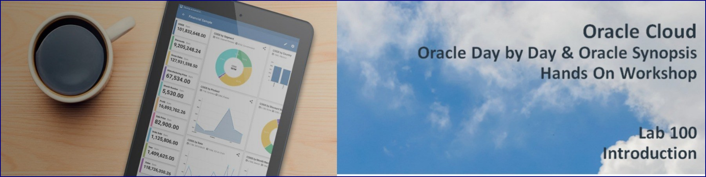
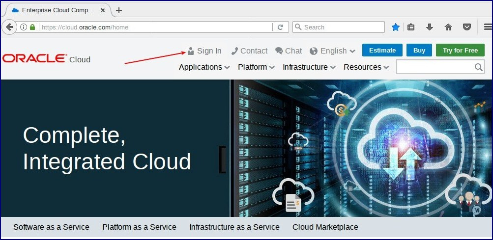
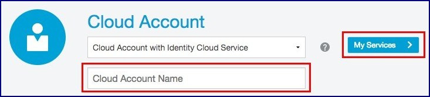
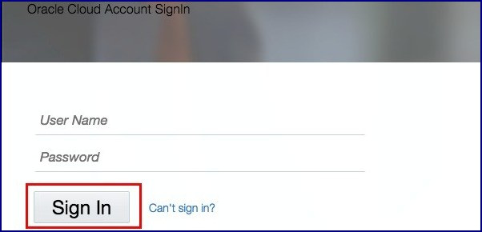

# Backgound Challenges for Synopsis

In this lab you will assume the role of Manager of Sales Grace Hopper. Grace needs to travel across all of her regions to help close deals. She needs to know where she needs to focus her time and maximize her travel.

She just received Sales spreadssheet from her corporate office.  This is about the only report they generate for him that provides much value.  Unfortunately, every time she receives it, she manually scans through the numbers trying to create reports and charts in Excel that are useful.  
she has just boarded a train on her way to a sales office in one of her territories and she has an hour or so to kill. She is going to use her time to try out the Synopsis product, specifically looking for two things:
1)	Focus on Sales & Profit of North America Region 
2)	See who (Sales Rep) needs the most help in which City and for which Customer Segment and Product Category.

# Lab 100: Provisioning and Getting Started

## Lab Introduction
This lab walks you through the steps to get started using the Oracle Day by Day and Oracle Synopsis You will provision a new Autonomous Analytic Cloud service.  You will upload Data Sheets to Analytic Cloud Service and learn to Index & Monitor them for faster response. Note throughout all the labs you may see small differences between what you see in your accounts and the results of various steps due to cloud product updates. 

To log issues and view the Lab Guide source, go to the [github oracle](https://github.com/oracle/learning-library/tree/master/workshops/Synopsis) repository.

## Objectives
-   Learn how to provision an Autonomous Analytic Cloud Service
-   Learn how to connect upload Data Sheets to Analytic Cloud Service 
-   Learn how to index the Data Sheets.
-   Monitor Index creation

## Required Artifacts
- The following lab requires an Oracle Public Cloud account. You may use your own cloud account, a cloud account that you obtained through a trial, or a training account whose details were given to you by an Oracle instructor.

# Steps

## Provisioning an Autonomous Analytic Cloud Service
In this section you will be provisioning an Autonomous Analytic Cloud Service using the cloud console.

### **STEP 1: Sign in to Oracle Cloud**
- Go to [cloud.oracle.com](https://cloud.oracle.com), click `Sign In` to sign in with your Oracle Cloud account.

  

- Enter your `Cloud Account Name` and click `My Services`.

  

- Enter your Cloud `username` and `password`, and click `Sign In`.

  

### **STEP 2: Initiate the creation of an Autonomous Analytic Cloud service.  Note this will take approximately two hours.**

- Click on `My Services` to go to your Dashboard (if you are not already there).  Select `Compute`.  You may need to select `Customize Dashboard` if you do not see `Compute`.

  

  

- Go to the menu in the upper left, select `Identity`, and then `Users`.

  

- Selecct the user.

  

- Select `Auth Tokens` on the left and then `Generate Token`.

  

  

- Be sure to copy the generated token to a notepad.  You will need it when creating an OAC instance.

  

- Next go back to the menu in the top left and select `Object Storage`.  

  

- Create a new bucket - call it `oac`.

  

  

- Now we will create a new Autonomous Oracle Analytic Service.  Select `My Services`.

  

- Select `Autonomous Analytics`.  You may need to customize the dashboard to make the service visible.

  

  

- Create instance.

  

- Enter the following details.  Retrieve your authentication token from the notepad where you copied it earlier.

  

  

# Conclusion
Grace Hopper found that creating a new Autonomous Analytic Cloud service is very very easy, and took only a couple of minutes to create.

You can now move on to the next lab.